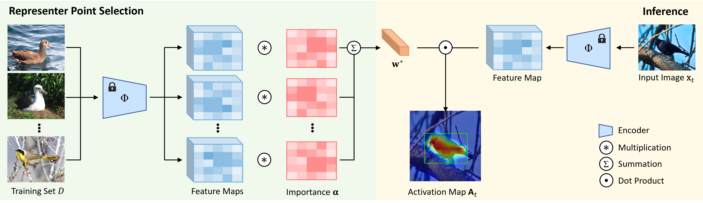

<div align='center'>
    <h1>Unsupervised Object Localization with Representer Point Selection</h1>

  <div>
      <a href="https://jeanyson.github.io/lab/members/" target="_blank">Yeonghwan Song</a><sup>*</sup>,
      <a href="https://jeanyson.github.io/lab/members/" target="_blank">Seokwoo Jang</a><sup>*</sup>,
      <a href="https://people.csail.mit.edu/dina/" target="_blank">Dina Katabi</a>,
      <a href="https://jeanyson.github.io/" target="_blank">Jeany Son</a><sup>*</sup>
  </div>
  <div>
      Gwangju Institute of Science and Technology<sup>*</sup>, Massachusetts Institute of Technology
  </div>
  <div>
      In ICCV 2023.
  </div>
  
[paper](https://arxiv.org/pdf/2309.04172v1.pdf) | [arxiv](https://arxiv.org/abs/2309.04172v1)

  <div style="width: 80%; text-align: center; margin:auto;">
      
  </div>

</div>


## Overview

The paper introduces a novel unsupervised object localization method that leverages self-supervised pre-trained models without the need for additional finetuning. Traditional methods often utilize class-agnostic activation maps or self-similarity maps from a pre-trained model. However, these maps have limitations in explaining the model's predictions. This work proposes an unsupervised object localization technique based on representer point selection. In this approach, the model's predictions are represented as a linear combination of representer values of training points. By selecting these representer points, which are the most influential examples for the model's predictions, the model can offer insights into its prediction process by showcasing relevant examples and their significance. The proposed method surpasses the performance of state-of-the-art unsupervised and self-supervised object localization techniques on various datasets. It even outperforms some of the latest weakly supervised and few-shot methods.

If you find this repository useful for your publications, please consider citing out paper.

```angular2html
@InProceedings{Song_2023_ICCV,
    author    = {Yeonghwan Song, Seokwoo Jang, Dina Katabi, Jeany Son},
    title     = {Unsupervised Object Localization with Representer Point Selection},
    booktitle = {ICCV},
    year      = {2023},
}
```

## Dependencies

    - pytorch >= 1.10.0
    - torchvision >= 0.11.0
    - efficientnet-pytorch >= 0.7.1
    - tqdm >= 4.65.0


## Dataset

You will need to download the images and structure the data directory referring to [this repository](https://github.com/clovaai/wsolevaluation).

You will need to download the images in your data root directory to evaluate our model on each dataset.

- Stanford Cars: http://vision.stanford.edu/aditya86/ImageNetDogs/
  
- FGVC-Aircraft: https://www.robots.ox.ac.uk/~vgg/data/fgvc-aircraft/
  
- Stanford Dogs: http://vision.stanford.edu/aditya86/ImageNetDogs/

## Inference

- Download pre-trained weights: [Google Drive](https://drive.google.com/drive/folders/1B0OolMMlwL6M5fpwEnMHJkqXh_zE8-6u?usp=sharing)

- Run the following command to reproduce our results
### ImageNet-1K / OpenImages30K
    ```bash
    python main.py --dataset EVALUATION_DATASET --loc_network EVALUATION_NETWORK --data_dir YOUR_DATAROOT
    ```

### CUB-200-2011 / Stanford Cars / FGVC-Aircraft / Stanford Dogs
    ```bash
    python main.py --dataset EVALUATION_DATASET --loc_network EVALUATION_NETWORK --data_dir YOUR_DATAROOT --image_size 480 --crop_size 448 --resnet_downscale 32 
    ```

### Segmentation on CUB-200-2011
    ```bash
    python main.py --dataset CUBSEG --loc_network EVALUATION_NETWORK --data_dir YOUR_DATAROOT --image_size 480 --crop_size 448 --resnet_downscale 32 
    ```

### Other Argments
    Employing class-specific parameters: --classwise

    Set the sampling ratio: _i.e._ --sampling_ratio 0.1

    Zero-shot transferring: _i.e._ --base_dataset CIFAR10

    Evaluating with classifier: _i.e._ --cls_network ResNet50